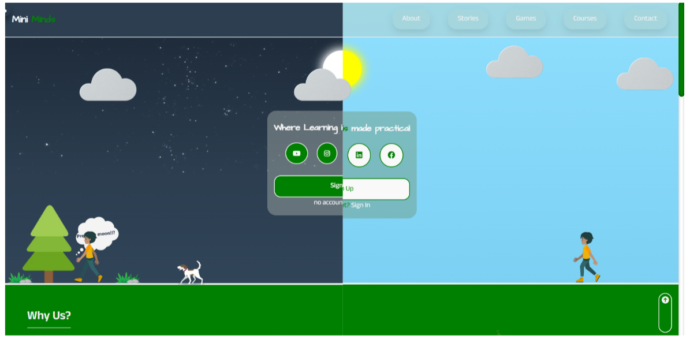

<h1 style="font-weight: bold;">MINI MINDS 💻</h1>
<p>
   <a href="#technologies">Technologies</a>
   <a href="#started">Getting Started</a>
</p>
<p>mini minds is made for children of age 5-12 where, they find education in a fun games and courses that have rewards on completion </p>
<p align="center">
   <a href="https://alurubalakarthikeya.github.io/miniminds.io/">📱 Check Project</a>
</p>
<h2 id="layout">🎨 Layout</h2>
<p align="center">
   
</p>
<h2>🧰 Tech Stack</h2>

### 📱 **Frontend**  


### 🔩 **Other Tools**  


### 🪛 **Version Control**  


### 🚥 **Hosting**  


<h2 id="started">🚀 Getting started</h2>
To run this project locally copy the below link and you can clone this project and make your version of this project
<h3>Cloning</h3>
How to clone this project:

```bash
git clone https://github.com/alurubalakarthikeya/miniminds.io
```
